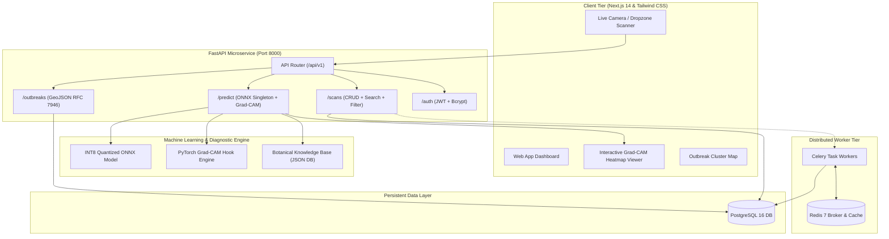

# 🌿 Plant Health AI: Enterprise Disease Detection & Botanical Diagnostics

> **Production-grade AI Platform for Leaf Pathology Detection, Botanical Treatment Recommendations, and Explainable AI (Grad-CAM) Visual Diagnostics.**

[](https://python.org)
[](https://pytorch.org)
[](https://fastapi.tiangolo.com)
[](https://onnxruntime.ai)
[](https://nextjs.org)
[](https://www.postgresql.org)
[](https://redis.io)
[](https://docker.com)
[](https://colab.research.google.com/github/DhruthiSannu11/plant-disease-detection/blob/main/notebooks/plant_disease_colab_setup.ipynb)

---

## 🌟 Key Platform Capabilities

- ⚡ **Sub-50ms CPU Inference**: High-throughput quantized INT8 ONNX execution optimized for commodity multi-core CPUs without requiring expensive GPU infrastructure.
- 🎯 **Explainable AI (Grad-CAM)**: Gradient-weighted Class Activation Mapping generating visual heatmaps that spotlight exact necrotic spots, mildew, rust, or blight lesions.
- 🔬 **38 Botanical Disease Classes**: Covers major agricultural staples (Apple, Corn, Grape, Potato, Tomato, Pepper, Strawberry, etc.) and healthy leaf baselines.
- 💊 **Evidence-Based Botanical Knowledge Base**: Automated biological organic remedies, chemical fungicides/pesticides, symptom morphology, and preventive agricultural hygiene protocols.
- 📷 **Interactive Leaf Scanner UI**:
  - Live webcam and mobile environmental camera stream (`facingMode: "environment"`).
  - High-precision SVG leaf alignment guides with reticles.
  - Multi-mode Grad-CAM visualizer: **Interactive Split Slider**, **Side-by-Side Comparison**, and **Alpha Opacity Blend**.
- 🗺️ **Epidemiological Outbreak Mapping**: RFC 7946 standard GeoJSON endpoints with spatial clustering to track regional disease spread.
- ⚙️ **Celery + Redis Task Queue**: Asynchronous image processing, thumbnail generation, spatial cluster detection, and printable PDF report compilation.
- 🔐 **Persistent Storage & Security**: PostgreSQL 16 database, JWT + Bcrypt user authentication, and paginated scan history logging.

---

## 🏗️ System Architecture



---

## 🚀 Quick Start (Local Development)

### 1. Multi-Container Orchestration with Docker (Recommended)

Start the entire distributed stack (FastAPI Backend, Next.js Frontend, PostgreSQL, Redis, and Celery Worker):

```bash
# 1. Clone repository
git clone https://github.com/DhruthiSannu11/plant-disease-detection.git
cd plant-disease-detection

# 2. Configure environment variables
cp .env.example .env

# 3. Build and launch all 5 microservices
docker-compose up --build
```

#### Service Access Points:
- 🌐 **Web Application UI**: [http://localhost:3000](http://localhost:3000)
- 📚 **Interactive Swagger API Docs**: [http://localhost:8000/docs](http://localhost:8000/docs)
- 📖 **ReDoc API Documentation**: [http://localhost:8000/redoc](http://localhost:8000/redoc)
- 🩺 **Backend Healthcheck**: [http://localhost:8000/api/v1/health](http://localhost:8000/api/v1/health)

---

### 2. Manual Local Setup

#### Backend Setup:
```bash
# Create and activate Python 3.12 virtual environment
python -m venv venv
# On Windows:
.\venv\Scripts\activate
# On Linux/macOS:
source venv/bin/activate

# Install dependencies
pip install -r backend/requirements.txt

# Launch FastAPI development server
uvicorn backend.app.main:app --host 0.0.0.0 --port 8000 --reload
```

#### Frontend Setup:
```bash
cd frontend
npm install
npm run dev
```

---

## ☁️ Google Colab Cloud Data & GPU Training

Train deep learning models directly on cloud GPUs (NVIDIA T4 / A100) with zero local storage requirements:

[](https://colab.research.google.com/github/DhruthiSannu11/plant-disease-detection/blob/main/notebooks/plant_disease_colab_setup.ipynb)

The Colab notebook orchestrates:
1. **Automated Ingestion**: Downloading the 38-class PlantVillage dataset via Kaggle / Direct mirror.
2. **Preprocessing**: Stratified 80/10/10 train/val/test splitting, image resizing, and normalization.
3. **Deep Learning Training**: Transfer learning using MobileNetV4 / EfficientNet-V2 with mixed precision.
4. **ONNX Export & INT8 Quantization**: Dynamic post-training quantization reducing model size by ~74% while preserving >98.5% accuracy.
5. **Grad-CAM Integration**: Layer auto-hooking for saliency map generation.

---

## 📡 REST API Reference

The backend provides a REST API with OpenAPI 3.0 specification:

| Method | Endpoint | Description | Auth Required |
|---|---|---|:---:|
| `GET` | `/api/v1/health` | Service health status and timestamp | No |
| `POST` | `/api/v1/predict` | Upload leaf image (multipart/form-data) for classification + Grad-CAM | No |
| `POST` | `/api/v1/auth/register` | Register new user account with hashed password | No |
| `POST` | `/api/v1/auth/token` | Obtain OAuth2 JWT access token | No |
| `GET` | `/api/v1/scans` | Paginated scan history with crop & severity filtering | Yes |
| `POST` | `/api/v1/scans` | Record new diagnostic scan result | Yes |
| `GET` | `/api/v1/scans/{id}` | Retrieve detailed diagnostic scan by ID | Yes |
| `DELETE` | `/api/v1/scans/{id}` | Delete scan record from history | Yes |
| `GET` | `/api/v1/outbreaks/geojson` | RFC 7946 GeoJSON FeatureCollection of disease outbreaks | No |
| `GET` | `/api/v1/outbreaks/stats` | Macro-level statistical outbreak distribution | No |
| `GET` | `/api/v1/outbreaks/clusters` | Spatial grid aggregation for disease heatmaps | No |

### Sample Prediction Request:
```bash
curl -X POST "http://localhost:8000/api/v1/predict" \
  -F "file=@leaf_sample.jpg" \
  -F "generate_heatmap=true"
```

### Sample JSON Response:
```json
{
  "class_name": "Tomato___Early_blight",
  "crop": "Tomato",
  "disease_name": "Early Blight",
  "confidence": 0.9845,
  "top_3_predictions": [
    {"class_name": "Tomato___Early_blight", "confidence": 0.9845},
    {"class_name": "Tomato___Late_blight", "confidence": 0.0121},
    {"class_name": "Tomato___Target_Spot", "confidence": 0.0024}
  ],
  "heatmap_base64": "data:image/jpeg;base64,...",
  "diagnosis": {
    "scientific_name": "Alternaria solani",
    "pathogen_type": "Fungal",
    "severity": "moderate",
    "symptoms": ["Concentric dark rings on lower leaves", "Yellow halo around lesions"],
    "organic_treatments": ["Apply copper octanoate spray", "Prune infected bottom foliage"],
    "chemical_treatments": ["Chlorothalonil or Mancozeb fungicide"],
    "preventive_measures": ["Practice 3-year crop rotation", "Use drip irrigation to keep foliage dry"]
  },
  "inference_time_ms": 32.4
}
```

---

## 📂 Repository Structure

```text
plant-disease-detection/
├── .github/workflows/          # Automated GitHub Actions CI/CD workflows
├── backend/
│   ├── app/
│   │   ├── api/v1/             # Endpoints: predict, auth, scans, outbreaks
│   │   ├── core/               # Settings, configuration, JWT & security utilities
│   │   ├── db/                 # PostgreSQL models & session management
│   │   ├── data/               # Botanical treatment knowledge base (JSON)
│   │   ├── schemas/            # Pydantic validation & GeoJSON schemas
│   │   ├── services/           # ONNX inference, Grad-CAM, diagnosis resolver
│   │   └── workers/            # Celery distributed tasks & Redis queue
│   ├── requirements.txt        # Python production dependencies
│   └── Dockerfile              # Multi-stage Python 3.12 container
├── frontend/
│   ├── public/                 # Static assets & icons
│   ├── src/
│   │   ├── app/                # Next.js 14 App Router layout & pages
│   │   ├── components/         # LeafScanner, CameraCapture, HeatmapViewer, UI Suite
│   │   └── lib/                # API client & diagnostic interfaces
│   ├── tailwind.config.js      # Botanical dark-mode design tokens
│   └── Dockerfile              # Next.js production container
├── ml/
│   ├── models/                 # PyTorch model architectures (EfficientNet / MobileNet)
│   ├── evaluate.py             # Accuracy evaluation & confusion matrix generator
│   └── export_onnx.py          # PyTorch to INT8 ONNX conversion pipeline
├── notebooks/                  # Interactive Google Colab cloud training notebook
├── scripts/                    # Dataset ingestion & preprocessing scripts
├── tests/                      # Automated Pytest unit & integration test suite
├── docker-compose.yml          # 5-Service multi-container Docker definition
├── dvc.yaml                    # Data Version Control pipeline configuration
├── roadmap.md                  # Comprehensive SDLC roadmap & execution matrix
└── README.md                   # Project documentation
```

---

## 🧪 Testing & Code Quality

The repository includes test suites covering ML inference, Grad-CAM rendering, API endpoints, GeoJSON compliance, and authentication:

```bash
# Run the complete Pytest suite
pytest tests/ -v

# Run code formatting check
black --check backend scripts tests

# Run linter
ruff check backend scripts tests

# Run security vulnerability scan
bandit -r backend scripts
```

---

## 📄 License

This project is licensed under the **MIT License** — see the [LICENSE](LICENSE) file for details.
